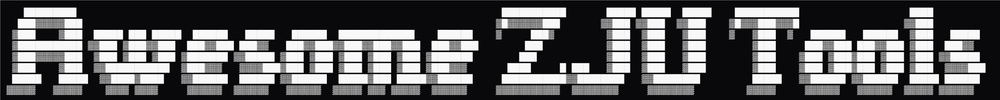

> 浙江大学生态圈中提高学习、科研与生活效率的工具、脚本、资源与模版合集[^claim]

- [📚 学习与课程助手](#-学习与课程助手)
  - [软件类](#软件类)
  - [网站类](#网站类)
  - [脚本类](#脚本类)
  - [部分 Web 插件](#部分-web-插件)
- [💡 AI 工具](#-ai-工具)
- [⚙️ 科研工具](#️-科研工具)
- [⏰ 时间管理与日程同步](#-时间管理与日程同步)
- [🌐 校园网络与系统工具](#-校园网络与系统工具)
- [📓 资源、笔记与教程](#-资源笔记与教程)
  - [资源类](#资源类)
  - [笔记/教程类](#笔记教程类)
- [🧮 模板与写作工具](#-模板与写作工具)
  - [论文/实验报告模板](#论文实验报告模板)
  - [PPT/Slides](#pptslides)
  - [网站](#网站)
  - [绘图](#绘图)
- [🧑‍💻 ZJU Hacks](#-zju-hacks)
- [🌐 其他](#-其他)
  - [网页](#网页)
  - [软件](#软件)
- [Contributing](#contributing)
- [致谢](#致谢)

## 📚 学习与课程助手

### 软件类

| 名称 | 简介 | 来源 | 作者/发起人 |
|------|------|------|------|
| [zju-learning-assistant](https://github.com/PeiPei233/zju-learning-assistant) | 快速下载整门课件、PPT、视频 | GitHub  | [PeiPei233](https://github.com/PeiPei233) |
| [fiz](https://github.com/CrazySpottedDove/fiz) | 高速简洁的学在浙大第三方 | GitHub  | [CrazySpottedDove](https://github.com/CrazySpottedDove) |
| [Quantum](https://github.com/XmmShp/Quantum) | 服务于 ZJUers 的桌面端工具箱 | GitHub  | [XmmShp](https://github.com/XmmShp) |
| [ZJU-MOTIS](https://github.com/xi2p/ZJU-MOTIS) | 选课辅助系统 | GitHub  | [xi2p](https://github.com/xi2p) |
| [chalaoshi](https://github.com/zjuchalaoshi/chalaoshi?tab=readme-ov-file) ※ | 匿名评教工具 | GitHub  | [zjuchalaoshi](https://github.com/zjuchalaoshi) |

### 网站类

| 名称 | 简介 | 来源 | 作者/发起人 |
|------|------|------|------|
| [思政刷题器](https://study.zjueva.net/) | 思政在线刷题工具 | Web | [ADSR1042](https://github.com/ADSR1042) |
| [大英默写器](https://eng.zjueva.net/) | 英语单词默写工具 | Web | [ADSR1042](https://github.com/ADSR1042) |
| [iLovePDF](https://www.ilovepdf.com/zh-cn) ※ | PDF 文件在线处理工具 | Web | - |

### 脚本类

| 名称 | 简介 | 来源 | 作者/发起人 |
|------|------|------|------|
| [Learning-at-ZJU-Helper](https://github.com/memset0/Learning-at-ZJU-Helper) | 学在浙大 / 智云课堂辅助脚本 | GitHub  | [memset0](https://github.com/memset0) |
| [Lazuli](https://chromewebstore.google.com/detail/lazuli/gpiacjfgnabenbpincmnbinfmbihloed) | 浙江大学教务系统增强插件 | Chrome 应用商店   | [ADSR1042](https://github.com/ADSR1042) |
| [智云课堂小助手 PC 端](https://www.cc98.org/topic/5648174) | 一键下载课程回放 / PPT / 字幕 | CC98 | [非牛顿流体](https://www.cc98.org/user/id/613815) |
| [智云课堂批量下载](https://greasyfork.org/zh-CN/scripts/514465-%E6%99%BA%E4%BA%91%E8%AF%BE%E5%A0%82%E6%89%B9%E9%87%8F%E4%B8%8B%E8%BD%BD) | 批量下载课程视频的脚本 | Greasy Fork  | [Cold_Ink 杰](https://www.cc98.org/user/id/701617) |
| [学在浙大待办事项链接修复](https://greasyfork.org/zh-CN/scripts/513507-%E5%AD%A6%E5%9C%A8%E6%B5%99%E5%A4%A7%E5%BE%85%E5%8A%9E%E4%BA%8B%E9%A1%B9%E9%93%BE%E6%8E%A5%E4%BF%AE%E5%A4%8D) | 学在浙大待办事项链接修复 | Greasy Fork  | [Cold_Ink 杰](https://www.cc98.org/user/id/701617) |
| [智云课堂搜索显示学期](https://greasyfork.org/zh-CN/scripts/498824-%E6%99%BA%E4%BA%91%E8%AF%BE%E5%A0%82%E6%90%9C%E7%B4%A2%E6%98%BE%E7%A4%BA%E5%AD%A6%E6%9C%9F) | 优化课程搜索体验 | Greasy Fork  | [Cold_Ink 杰](https://www.cc98.org/user/id/701617) |
| [教学管理一键评教](https://greasyfork.org/zh-CN/scripts/498990-%E6%B5%99%E6%B1%9F%E5%A4%A7%E5%AD%A6%E6%95%99%E5%AD%A6%E7%AE%A1%E7%90%86%E4%B8%80%E9%94%AE%E8%AF%84%E6%95%99) | 一键评教 | Greasy Fork  | [Cold_Ink 杰](https://www.cc98.org/user/id/701617) |
| [智云导出 ppt 和字幕组合](https://github.com/Auspiow/zhiyun-extension) | 智云课堂辅助脚本 | GitHub  | [Auspiow](https://github.com/Auspiow) |
| [website-converter](https://github.com/Slowist-Lee/website-converter) | WebVPN 链接转换器 | GitHub  | [Slowist-Lee](https://github.com/Slowist-Lee) |

### 部分 Web 插件

> 此部分仅节选部分网络上热门的插件

| 名称 | 简介 | 来源 |
|------|------|------|
| [Tampermonkey](https://chromewebstore.google.com/detail/tampermonkey/dhdgffkkebhmkfjojejmpbldmpobfkfo?hl=zh-cn) ※ | 用户脚本管理扩展 | Chrome 应用商店  |
| [Global Speed](https://chromewebstore.google.com/detail/global-speed-%E8%A7%86%E9%A2%91%E9%80%9F%E5%BA%A6%E6%8E%A7%E5%88%B6/jpbjcnkcffbooppibceonlgknpkniiff?hl=zh-cn) ※ | 视频加速控制插件 | Chrome 应用商店  |
| [AdBlock](https://chromewebstore.google.com/detail/adblock-%E6%8B%A6%E6%88%AA%E6%95%B4%E4%B8%AA%E7%BD%91%E7%BB%9C%E7%9A%84%E5%B9%BF%E5%91%8A/gighmmpiobklfepjocnamgkkbiglidom?hl=zh-cn) ※ | 广告拦截 | Chrome 应用商店  |
| [uBlock Origin Lite](https://chromewebstore.google.com/detail/ublock-origin-lite/ddkjiahejlhfcafbddmgiahcphecmpfh?hl=zh-cn) ※ | 广告拦截 | Chrome 应用商店  |
| [Vimium](https://chromewebstore.google.com/detail/vimium/dbepggeogbaibhgnhhndojpepiihcmeb?hl=zh-cn) ※ | 键盘浏览工具 | Chrome 应用商店  |

## 💡 AI 工具

| 名称 | 简介 |
|------|------|
| [ZChat](https://zchat.tech) | AI 聊天工具 |
| [Chatbot Arena](https://openlm.ai/chatbot-arena/) ※ | Chatbot 排行榜 |
| [SEAL LLM Leaderboards](https://scale.com/leaderboard) ※ | LLM 排行榜 |

## ⚙️ 科研工具

| 名称 | 简介 | 来源 | 作者/发起人 |
|------|------|------|------|
| [learning_research](https://github.com/pengsida/learning_research?tab=readme-ov-file) | 彭思达学长的科研经验分享 | [GitHub](https://github.com/pengsida/learning_research)  | [彭思达](http://pengsida.net) |
| [awesome-phd-advice](https://github.com/pliang279/awesome-phd-advice) ※ | Collection of advice for prospective and current PhD students | [GitHub](https://github.com/pliang279/awesome-phd-advice)  | [pliang279](https://github.com/pliang279) |
| [PaperWriting](https://github.com/wangdongdut/PaperWriting) ※ | 论文写作经验总结 | GitHub  | [wangdongdut](https://github.com/wangdongdut) |

| 名称 | 简介 | 来源 | 作者/发起人 |
|------|------|------|------|
| [AI-research-tools](https://github.com/bighuang624/AI-research-tools) ※ | AI 方向好用的科研工具合集 | GitHub  | [bighuang624](https://github.com/bighuang624) |
| [cool papers](https://papers.cool) ※ | 沉浸式刷论文 | [GitHub](https://github.com/bojone/papers.cool)  | [苏剑林](https://kexue.fm) |
| [zotero-arxiv-daily](https://github.com/TideDra/zotero-arxiv-daily) ※ | 每日论文推荐 | GitHub  | [TideDra](https://github.com/TideDra) |
| [zotero-better-notes](https://github.com/windingwind/zotero-better-notes) | [化繁为简，快速提炼：Zotero 文献笔记最佳实践 - CC98 论坛](https://www.cc98.org/topic/5348707) | GitHub  | [windingwind](https://github.com/windingwind) |
| [zotero-pdf-translate](https://github.com/windingwind/zotero-pdf-translate) | 翻译 PDF, EPub, webpage, metadata, annotations, notes | GitHub  | [windingwind](https://github.com/windingwind) |
| [zotero-actions-tags](https://github.com/windingwind/zotero-actions-tags) | Customize your Zotero workflow. | GitHub  | [windingwind](https://github.com/windingwind) |
| [zotero-style](https://github.com/MuiseDestiny/zotero-style) ※ | Ethereal Style for Zotero | GitHub  | [MuiseDestiny](https://github.com/MuiseDestiny) |
| [DownGit](https://www.itsvse.com/downgit/#/home) ※ | Create GitHub Resource Download Link | [GitHub](https://github.com/MinhasKamal/DownGit)  | [MinhasKamal](https://github.com/MinhasKamal) |
| [GitHub-proxy](https://gh-proxy.com/) ※ | GitHub 文件代理加速 | Web | - |

## ⏰ 时间管理与日程同步

| 名称 | 简介 | 来源 | 作者/发起人 |
|------|------|------|------|
| [Celechron](https://github.com/Celechron/Celechron) | 服务于浙大学生的时间管理器，支持日历同步 | GitHub  | [Celechron](https://github.com/Celechron) |
| [ZJU-ICAL](https://ical.raynor.top/static) | 以订阅链接形式导入课表至系统日历 | GitHub  | [cxz66666](https://github.com/cxz66666) |
| [zju-ical-py](https://github.com/Xecades/zju-ical-py?tab=readme-ov-file) | 基于 zju-ical 项目的 Python 重构版本 | GitHub  | [Xecades](https://github.com/Xecades) |
| [ZTA](https://github.com/wdtjm/zta) | 桌面端时间管理工具 | GitHub  | [wdtjm](https://github.com/wdtjm) |

## 🌐 校园网络与系统工具

| 名称 | 简介 | 来源 | 作者/发起人 |
|------|------|------|------|
| [zjunet](https://github.com/QSCTech/zjunet) | ZJU 校园网命令行工具（VPN / WLAN / DNS） | GitHub  | [QSCTech](https://github.com/QSCTech) |
| [zju-connect](https://github.com/Mythologyli/zju-connect) | ZJU RVPN 客户端的 Go 实现 | GitHub  | [Mythologyli](https://github.com/Mythologyli) |
| [ZJU-Rule](https://github.com/SubConv/ZJU-Rule) | ZJU Clash 分流规则 | GitHub  | [wouiSB](https://github.com/wouiSB) |
| [EZ4Connect](https://github.com/PageChen04/EZ4Connect) | 改进的 ZJU-Connect 图形界面（支持 macOS 和 Linux 系统） | GitHub  | [PageChen04](https://github.com/PageChen04) |

## 📓 资源、笔记与教程

### 资源类

| 名称 | 简介 | 来源 |
|------|------|------|
| [浙江大学课程攻略共享计划](https://github.com/QSCTech/zju-icicles) | 全校课程笔记与攻略合集 | GitHub  |
| [ZJU-OPT](https://github.com/yinze00/ZJU-OPT) | 光电信息科学与工程（OPT）课程共享计划 | GitHub  |
| [zju-isee](https://github.com/zju-isee/zju-isee) | 浙江大学电子科学与技术专业部分课程仓库 | GitHub  |
| [CourseNoteOfZJUSE](https://github.com/Zhang-Each/CourseNoteOfZJUSE) | ZJU-SE 的一些课程笔记、历年卷、课程经历分享 | GitHub  |
| [ZJU-EE](https://github.com/alwaysbyx/ZJU-EE) | 浙江大学电气工程学院（自动化）课程指南 | GitHub  |
| [ZJU_Course](https://github.com/RyanFcr/ZJU_Course?tab=readme-ov-file) | 个人计算机课程资料整理（浙大 CS 专业） | GitHub  |
| [SLOFFDE](https://mp.weixin.qq.com/s/O1wa9_9zslam7ovctp4ffw) | 医学类专业课以及基础课程 | 公众号 |
| [一起学习德智体](https://mp.weixin.qq.com/s/AebEozF9Xemqb1BfIFLayg)| 电气工程专业个人资源站 | 公众号 |
| [路老师的 nonsense collection](https://mp.weixin.qq.com/s/-hBAeed1AWT35l6Xc5svXQ)| 微积分相关资源 | 公众号 |
| [Randall 爱数学](https://mp.weixin.qq.com/s/M6ulC2ljYVDZ2mqXJRST-Q) | 线代答案、回忆卷相关资源 | 公众号 |
| [农生链](https://mp.weixin.qq.com/s/qTc_Reqa8HxLa3boh988Wg) | 由学生运营的农生环专业资源与经验分享平台 | 公众号 |

### 笔记/教程类

| 名称 | 简介 | 来源 |
|------|------|------|
| [zju-welcome](https://zjuers.com/welcome/) | 浙江大学新生入学指南 | [GitHub](https://github.com/kaixuanwang2003/zju-welcome)  |
| [图灵班学习指南](https://zju-turing.github.io/TuringCourses/) | 图灵班学习指南 | [GitHub](https://github.com/ZJU-Turing/TuringCourses/)  |
|[PracticalSkillsTutorial](https://slides.tonycrane.cc/PracticalSkillsTutorial/) | 「实用技能拾遗」系列辅学课程网站 | [GitHub](https://github.com/TonyCrane/PracticalSkillsTutorial)  |
| [ZJU CS - All Sum in One!](https://isshikihugh.github.io/zju-cs-asio/) | 收集 ZJU-CS 相关网站与学习资料索引 | [GitHub](https://github.com/IsshikiHugh/zju-cs-asio)  |
| [Linear-Algebra-Left-Undone](https://github.com/yhwu-is/Linear-Algebra-Left-Undone) | 线性代数：未竟之美 | [GitHub](https://github.com/yhwu-is/Linear-Algebra-Left-Undone)  |
| [Computer-System-Start-From-a-Newbie](https://yhwu-is.github.io/Computer-System-Start-From-a-Newbie/) | 计算机系统——从小白学起 | [GitHub](https://github.com/yhwu-is/Computer-System-Start-From-a-Newbie)  |
| [EEStUdy-Place](http://www.eestudy-place.com/) | 电气工程学院学习网站 | [GitHub](https://github.com/ZJU-EESUAD/EEStUdy-Place)  |
| [数学之韵](https://zju_math.pages.zjusct.io/mathweb/) | 数学专业课程经验与学习资料共享 | [ZJU Git](https://git.zju.edu.cn/zju_math/mathweb) |
| [力速双 A - ZJUSAA](https://fsaa.pages.zjusct.io/fsaa/) | 航空航天学院学习分享平台 | [ZJU Git](https://git.zju.edu.cn/fsaa/fsaa) |
| [Hikari of ME](https://pages.koala-studio.org.cn/hikari-of-me-6645ba/) | 机械学院资源整理站 | [ZJU Git](https://git.zju.edu.cn/hikari-of-me/hikari-of-me) |

| 名称 | 简介 | 来源 |
|------|------|------|
| [SurfingTutorial](https://github.com/mzdluo123/SurfingTutorial) ※ | 给新大学生的网上冲浪和计算机使用教程 | [GitHub](https://github.com/mzdluo123/SurfingTutorial)  |
| [How-To-Ask-Questions](https://github.com/ryanhanwu/How-To-Ask-Questions-The-Smart-Way/blob/main/README-zh_CN.md) ※ | 提问的智慧 | [GitHub](https://github.com/ryanhanwu/How-To-Ask-Questions-The-Smart-Way)  |
| [csdiy.wiki](https://csdiy.wiki/) ※ | 计算机自学指南 | [GitHub](https://github.com/pkuflyingpig/cs-self-learning)  |
| [SurviveSJTUManual](https://survivesjtu.gitbook.io/survivesjtumanual) ※ | SJTU 生存手册 | [GitHub](https://github.com/SurviveSJTU/SurviveSJTUManual)  |
| [missing semester](https://missing-semester-cn.github.io/) ※ | MIT 课程 - 计算机教育中缺失的一课 | [GitHub](https://github.com/missing-semester-cn/missing-semester-cn)  |

## 🧮 模板与写作工具

### 论文/实验报告模板

| 名称 | 简介 | 来源 | 作者/发起人 |
|------|------|------|------|
| [zjuthesis](https://github.com/TheNetAdmin/zjuthesis) | 浙大毕业论文 LaTeX 模板 | GitHub  | [TheNetAdmin](https://github.com/TheNetAdmin) |
| [zjureport](https://github.com/megrxu/zjureport)| 一份浙江大学 LaTeX 实验报告模板 | GitHub  | [megrxu](https://github.com/megrxu) |
| [Overleaf 入门与 Latex 报告/作业模板](https://www.cc98.org/topic/5929587) | LaTeX 初学者指南 + 模板合集 | CC98 | [PhilFan](https://www.cc98.org/user/id/701211)|
| [typora-latex-theme](https://github.com/Keldos-Li/typora-latex-theme)| 将 Typora 伪装成 LaTeX 的中文样式主题 | GitHub  | [Keldos-Li](https://github.com/Keldos-Li) |
| [modern-zju-thesis](https://github.com/Shuenhoy/modern-zju-thesis) | 浙江大学 Typst 学位论文模版 | GitHub  | [Shuenhoy](https://github.com/Shuenhoy) |
| [ZJU-Project-Report-Template](https://github.com/memset0/ZJU-Project-Report-Template)| Typst 项目报告模板 | GitHub  | [memset0](https://github.com/memset0) |
| [zju-typst-tplt](https://github.com/ethanpixar/zju-typst-tplt)| 报告、作业、短文、笔记 Typst 四合一模版 | GitHub  | [ethanpixar](https://github.com/ethanpixar) |
| [zju-bubble](https://github.com/inuEbisu/bubble-zju) | 简洁现代的浙江大学 Typst 模版 | GitHub  | [犬戎](https://github.com/inuEbisu) |
| [markdown-it-typst](https://github.com/Xecades/markdown-it-typst) | Plugin to transform Typst code to SVG image for markdown-it markdown parser. | GitHub  | [Xecades](https://github.com/Xecades) |

### PPT/Slides

| 名称 | 简介 | 来源 | 作者/发起人 |
|------|------|------|------|
| [slide-template](https://github.com/TonyCrane/slide-template) | slide template for **reveal-md** | GitHub  | [TonyCrane](https://github.com/TonyCrane) |
| [浙大 PPT 模板分享](https://www.cc98.org/topic/5906507) | 求是蓝 / 答辩模板合集 | CC98 | [空山岁月老](https://www.cc98.org/user/id/654921) |
| [Awesome PPTs](https://www.cc98.org/topic/6290594)| CC98 版面 PPT 制作帖合集 | CC98 | [PhilFan](https://www.cc98.org/user/id/701211)|
| [BeamerthemeFormal](https://github.com/HGGshiwo/BeamerthemeFormal) | Beamer 模版 | GitHub  | [HGGshiwo](https://github.com/HGGshiwo) |
| [ZJU-Beamer-Template](https://github.com/qychen2001/ZJU-Beamer-Template) | Beamer 模板 | GitHub  | [qychen2001](https://github.com/qychen2001) |
| [SlideTemplate](https://github.com/inuEbisu/SlideTemplate) | MkSlides 模板 | GitHub  | [犬戎](https://github.com/inuEbisu) |

### 网站

| 名称 | 简介 | 来源 | 作者/发起人 |
|------|------|------|------|
| [academicpages](https://github.com/academicpages/academicpages.github.io) ※ | 学术网页模板 | GitHub  | [academicpages](https://github.com/academicpages) |
| [Material for MkDocs](https://squidfunk.github.io/mkdocs-material/) ※ | 简洁好用的 MkDocs 文档主题 | [GitHub](https://github.com/squidfunk/mkdocs-material)  | [squidfunk](https://github.com/squidfunk) |
| [GitHub Pages](https://docs.github.com/en/pages) ※ | GitHub Pages 文档 | GitHub | [GitHub](https://github.com/github) |
| [mkdocs-toolchain](https://github.com/TonyCrane/mkdocs-toolchain) | TonyCrane's Mkdocs toolchain | GitHub  | [TonyCrane](https://github.com/TonyCrane) |
| [Replicon](https://github.com/inuEbisu/Replicon?tab=readme-ov-file) | 基于 Typecho 默认主题开发的博客主题 | GitHub  | [犬戎](https://github.com/inuEbisu) |

### 绘图

| 名称 | 简介 |
|------|------|
| [Excalidraw](https://excalidraw.com) ※ | 在线白板/矢量手绘风画图工具 |
| [Eraser](https://app.eraser.io/dashboard/all) ※ | 团队协作绘图、流程图和头脑风暴工具 |
| [draw.io](https://app.diagrams.net) ※ | 免费流程图和图表绘制工具 |
| [Mermaid](https://mermaid.js.org/) ※ | 使用 Markdown 语法生成流程图、序列图、甘特图等 |
| [Xmind](https://xmind.com/) ※ | 思维导图工具 |

## 🧑‍💻 ZJU Hacks

> ⚠️⚠️⚠️ **声明：以下脚本仅供学习与研究使用，请勿用于违反校规或相关平台条款的行为。本仓库不保证脚本的安全性、合法性，使用者需自行承担风险。**

| 名称 | 简介 | 来源 | 作者/发起人 |
|------|------|------|------|
| [EasySpider](https://github.com/NaiboWang/EasySpider) | 可视化浏览器自动化测试/数据采集/爬虫软件 | GitHub  | [NaiboWang](https://github.com/NaiboWang) |
| [evilScripts](https://github.com/ShawHaines/evilScripts) | CC98 / NexusHD 自动签到脚本 | GitHub  | [ShawHaines](https://github.com/ShawHaines) |
| [CC98Autosign](https://github.com/inuEbisu/CC98Autosign) | CC98 自动签到 Python 脚本 | GitHub  | [犬戎](https://github.com/inuEbisu) |
| [yacu](https://greasyfork.org/zh-CN/scripts/438399-yacu-yet-another-cc98-userscript) | CC98 风评统计、屏蔽 |  Greasy Fork  | [CoolSpring](https://www.cc98.org/user/id/602214) |
| [Fuck_QCZJ](https://github.com/WuliAPO/Fuck_QCZJ) ※ | 青年大学习打卡 | GitHub  | [WuliAPO](https://github.com/WuliAPO) |
| [iOSRealRun-cli-17](https://github.com/iOSRealRun/iOSRealRun-cli-17) ※ | (iOS 17+) 虚拟定位免越狱跑步打卡，支持随机速度与路线 | GitHub  | [iOSRealRun](https://github.com/iOSRealRun) |
| [iOSFakeRun](https://github.com/Mythologyli/iOSFakeRun) | iOS 虚拟跑步模拟，支持循环与随机路线 | GitHub  | [Mythologyli](https://github.com/Mythologyli) |
| [fuckZHS](https://github.com/VermiIIi0n/fuckZHS) ※ | 自动刷智慧树课程脚本 | GitHub  | [VermiIIi0n](https://github.com/VermiIIi0n) |
| [OCS 网课助手](https://docs.ocsjs.com/docs/quickly-start/) ※ | 刷 MOOC / 智慧树 自动化工具 | GitHub  | [ocsjs](https://github.com/ocsjs) |
| [GinsMooc](https://github.com/ginnnnnncc/GinsMooc) ※ | 中国大学 MOOC 自动答题插件 | GitHub  | [ginnnnnncc](https://github.com/ginnnnnncc) |
| [速刷新中特教学视频](https://www.cc98.org/topic/6003813) | 一键刷新中特教学视频 | CC98 | [吃个诸葛亮](https://www.cc98.org/user/id/613815) |
| [迎新系统测试](https://www.cc98.org/topic/6249309/1#1) | 一键通过研究生迎新系统中学术规范和安全测试 | CC98 | [方の馒头](https://www.cc98.org/user/id/785112) |
| [Quicker](https://github.com/IshiKura-a/Quicker) | 场馆预约自动化脚本 | GitHub  | [IshiKura-a](https://github.com/IshiKura-a) |

## 🌐 其他

### 网页

| 名称 | 简介 | 来源 |
|------|------|------|
| [ZJU 轻首页](https://zjuers.com/) | 浙江大学轻量级导航主页 | Web |
| [ZJU Git](https://git.zju.edu.cn) | 浙江大学 GitLab | Web |
| [ZJU Mirror](https://mirrors.zju.edu.cn/) | 浙江大学开源镜像站 | Web |
| [ZJU School-Bus](https://zjusec.com/) | 浙江大学 CTF 练习平台 | Web |
| [网大论坛](https://www.netbig.top/) ※ | 高教论坛 | Web |
| [LINUX DO](https://linux.do/) ※ | 新的理想型社区 | Web |

### 软件

| 名称 | 简介 | 来源 | 作者/发起人 |
|------|------|------|------|
| [CC98-Desktop](https://github.com/Ginsenvey/CC98-Desktop) | CC98 的 Windows 11 桌面客户端 | GitHub  | [Ginsenvey](https://github.com/Ginsenvey) |
| [浙里办 APP](https://www.zjzwfw.gov.cn/jpccweb/zlbAPPxz/zlbAPPxz/index.html) ※ | 浙江政务服务 APP 下载 | Web | - |

## Contributing

欢迎贡献更多 ZJU 效率工具与资源！  

你可以参照 [贡献指南](.github/CONTRIBUTING.md) 提交 Pull Request，或在 Issues 中推荐。

如果项目对你有帮助，⭐ Star 一下以支持项目更新！

## 致谢

- 本项目使用 [dar5hak/generator-awesome-list](https://github.com/dar5hak/generator-awesome-list) 生成项目 README 大纲。
- 使用 [huacnlee/autocorrect](https://github.com/huacnlee/autocorrect/), [DavidAnson/markdownlint-cli2-action](https://github.com/DavidAnson/markdownlint-cli2-action) 与 [gaurav-nelson/github-action-markdown-link-check](https://github.com/gaurav-nelson/github-action-markdown-link-check) 进行自动化检查。
- 使用 [Text to ASCII Art Generator](https://patorjk.com/software/taag/) 生成项目 Logo。
- 使用 [Shields.io](https://shields.io) 和 [Simple Icons](https://simpleicons.org) 生成项目 Badges。
- 感谢 [黎辉 - 学习天地工具与插件合集](https://www.cc98.org/topic/6054386)为项目提供灵感。
- 感谢 CC98 论坛[学习天地](https://www.cc98.org/board/68)与[编程技术](https://www.cc98.org/board/105)版面。
- 感谢 [Goya-ye](https://github.com/Goya-ye), [Zefiro380](https://www.cc98.org/user/id/784931), [Saoji](https://www.cc98.org/user/id/702983), [齐次](https://www.cc98.org/user/id/724283), [3200101971](https://www.cc98.org/user/id/648740), [loyu_Nemo](https://www.cc98.org/user/id/668186), [红豆糕糕糕](https://www.cc98.org/user/id/706456), [kkkkh-kh](https://github.com/kkkkh-kh), [XSYangtuo](https://www.cc98.org/user/id/733729) 等用户对于项目的建议。
- 感谢所有 **Contributors**!

[^claim]: 使用 `※` (U+203B) 符号标注非 ZJUer 开发或管理的资源。
